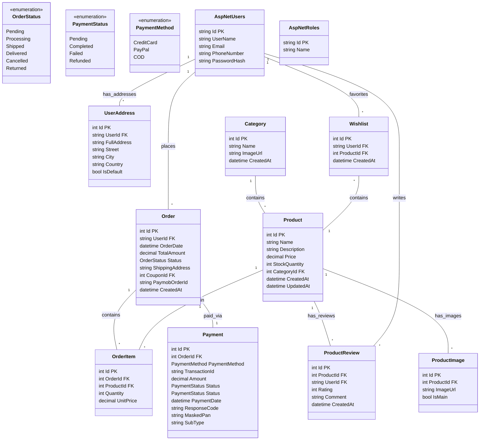

# Database Schema Design for E-Commerce App

This document outlines the database structure for your .NET & Flutter E-commerce graduation project.

## Overview
The system is built around **ASP.NET Core Identity** for user management. It includes core e-commerce features:
- **Catalog**: Categories & Products
- **Sales**: Orders, Order Items
- **Finance**: Payments

## 1. Identity & Users
We will use the standard `AspNetCore.Identity` tables.
- **AspNetUsers**: Stores user info (Id, Email, PasswordHash, etc.).
- **AspNetRoles**: Stores roles (Admin, Customer).
- **AspNetUserRoles**: Links users to roles.

## 2. Catalog
- **Categories**:
  - `Id` (int)
  - `Name`
  - `ImageUrl`
  - `CreatedAt` (datetime)
- **Products**:
  - `Id` (int)
  - `Name`
  - `Description`
  - `Price` (decimal)
  - `StockQuantity` (int)
  - `CategoryId` (FK)
  - `CreatedAt` (datetime)
  - `UpdatedAt` (datetime)
- **ProductImages**:
  - `Id` (int)
  - `ProductId` (FK)
  - `ImageUrl`
  - `IsMain` (bool)

## 3. Social & Shopping Features (New)
- **ProductReviews**:
  - `Id` (int)
  - `ProductId` (FK)
  - `UserId` (FK)
  - `Rating` (int, 1-5)
  - `Comment` (string)
  - `CreatedAt` (datetime)
- **Wishlists**:
  - `Id` (int)
  - `UserId` (FK)
  - `ProductId` (FK)
  - `CreatedAt` (datetime)

## 4. Users & Identity
- **UserAddresses** (New - Users can save multiple addresses):
  - `Id` (int)
  - `UserId` (FK)
  - `FullAddress` (string, complete address for display)
  - `Street`
  - `City`
  - `State`
  - `ZipCode`
  - `Country`
  - `IsDefault` (bool)

## 5. Sales & Orders
- **Orders**:
  - `Id` (int)
  - `UserId` (FK)
  - `OrderDate`
  - `TotalAmount`
  - `Status` (Enum: OrderStatus)
  - `CouponId` (FK, nullable)
  - `ShippingAddress` (string, Snapshot of FullAddress)
  - `PaymobOrderId` (string, External ID from Paymob)
  - `CreatedAt`
- **OrderItems**:
  - `Id` (int)
  - `OrderId` (FK)
  - `ProductId` (FK)
  - `Quantity`
  - `UnitPrice`

## 6. Payments
- **Payments**:
  - `Id` (int)
  - `OrderId` (FK)
  - `PaymentMethod` (Enum: PaymentMethod)
  - `TransactionId`
  - `Amount`
  - `Status` (Enum: PaymentStatus)
  - `Status` (Enum: PaymentStatus)
  - `PaymentDate`
  - `ResponseCode` (string, e.g. "APPROVED", "REJECTED")
  - `MaskedPan` (string, e.g. "**** **** **** 1234")
  - `SubType` (string, e.g. "VISA", "MasterCard", "Wallet")

## 7. Enums
- **OrderStatus**:
  - `Pending`, `Processing`, `Shipped`, `Delivered`, `Cancelled`, `Returned`
- **PaymentStatus**:
  - `Pending`, `Completed`, `Failed`, `Refunded`
- **PaymentMethod**:
  - `CreditCard`, `PayPal`, `COD` (Cash on Delivery)

## Visual Diagram (Mermaid)
You can copy the code below and insert it into Draw.io (Arrange > Insert > Advanced > Mermaid) or use it as a reference to draw manually.

