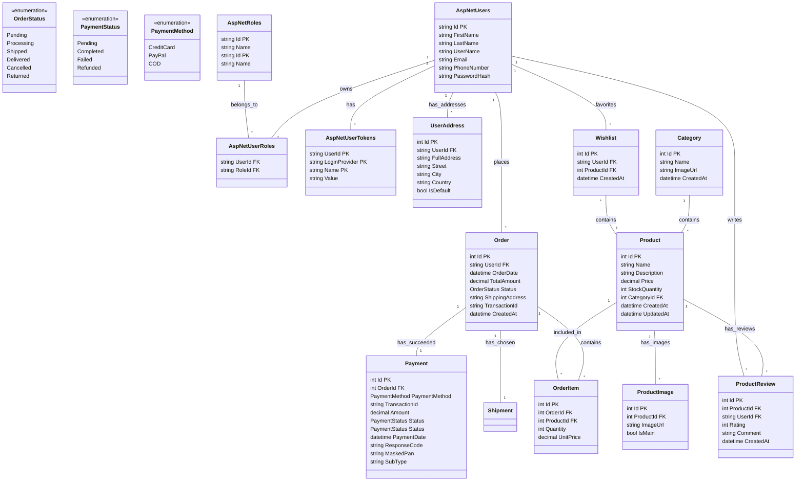

# Database Schema Design for E-Commerce App

This document outlines the database structure for your .NET & Flutter E-commerce graduation project.

## Overview
The system is built around **ASP.NET Core Identity** for user management. It includes core e-commerce features:
- **Catalog**: Categories & Products
- **Sales**: Orders, Order Items
- **Finance**: Payments

## 1. Identity & Users (ASP.NET Core Identity)
We will use the standard `AspNetCore.Identity` tables extended with custom fields.
- **AspNetUsers**:
  - `Id` (string, PK)
  - `FirstName` (string)
  - `LastName` (string)
  - `UserName`, `Email`, `PasswordHash`, `PhoneNumber`
- **AspNetRoles**: `Id`, `Name` (e.g. "Admin", "Customer")
- **AspNetUserRoles**: Mapping table between Users and Roles.
- **AspNetUserClaims**: Stats/Attributes for users.
- **AspNetUserLogins**: External auth providers (Google, Facebook).
- **AspNetUserTokens**: Logic tokens (Password Reset, Email Confirm, **Refresh Tokens**).
  - `UserId` (PK)
  - `LoginProvider` (PK)
  - `Name` (PK)
  - `Value` (The token string)

## 2. Catalog
- **Categories**:
  - `Id` (int)
  - `Name`
  - `ImageUrl`
  - `CreatedAt` (datetime)
- **Products**:
  - `Id` (int)
  - `Name`
  - `Description`
  - `Price` (decimal)
  - `StockQuantity` (int)
  - `CategoryId` (FK)
  - `CreatedAt` (datetime)
  - `UpdatedAt` (datetime)
- **ProductImages**:
  - `Id` (int)
  - `ProductId` (FK)
  - `ImageUrl`
  - `IsMain` (bool)

## 3. Social & Shopping Features (New)
- **ProductReviews**:
  - `Id` (int)
  - `ProductId` (FK)
  - `UserId` (FK)
  - `Rating` (int, 1-5)
  - `Comment` (string)
  - `CreatedAt` (datetime)
- **Wishlists**:
  - `Id` (int)
  - `UserId` (FK)
  - `ProductId` (FK)
  - `CreatedAt` (datetime)

## 4. Users & Identity
- **UserAddresses** (New - Users can save multiple addresses):
  - `Id` (int)
  - `UserId` (FK)
  - `FullAddress` (string, complete address for display)
  - `Street`
  - `City`
  - `State`
  - `ZipCode`
  - `Country`
  - `IsDefault` (bool)

## 5. Sales & Orders
- **Orders**:
  - `Id` (int)
  - `UserId` (FK)
  - `OrderDate`
  - `TotalAmount`
  - `ShippingCost` (decimal)
  - `ShippingAddress` (string, Snapshot of FullAddress)
  - `PaymentId` (FK, ID of the successful payment)
  - `ShipmentId` (FK, ID of the chosen shipment)
  - `CreatedAt`
- **OrderItems**:
  - `Id` (int)
  - `OrderId` (FK)
  - `ProductId` (FK)
  - `Quantity`
  - `UnitPrice`

## 7. Shipments (New)
- **Shipments**:
  - `Id` (int)
  - `OrderId` (FK)
  - `TrackingNumber` (string)
  - `Carrier` (string, e.g. "DHL", "Aramex")
  - `ShipmentDate` (datetime)
  - `EstimatedDelivery` (datetime)
  - `Cost` (decimal)

## 8. Paymob & Payments
- **Payments**:
  - `Id` (int)
  - `OrderId` (FK)
  - `PaymentMethod` (Enum: PaymentMethod)
  - `TransactionId`
  - `Amount`
  - `Status` (Enum: PaymentStatus)
  - `Status` (Enum: PaymentStatus)
  - `PaymentDate`
  - `Provider` (string, e.g. "Paymob", "PayPal")
  - `Details` (string, JSON/Generic field for MaskedPan, SubType, etc.)

## 9. Enums
- **OrderStatus**:
  - `Pending`, `Processing`, `Shipped`, `Delivered`, `Cancelled`, `Returned`
- **PaymentStatus**:
  - `Pending`, `Completed`, `Failed`, `Refunded`
- **PaymentMethod**:
  - `CreditCard`, `PayPal`, `COD` (Cash on Delivery)

## Visual Diagram (Mermaid)
You can copy the code below and insert it into Draw.io (Arrange > Insert > Advanced > Mermaid) or use it as a reference to draw manually.

